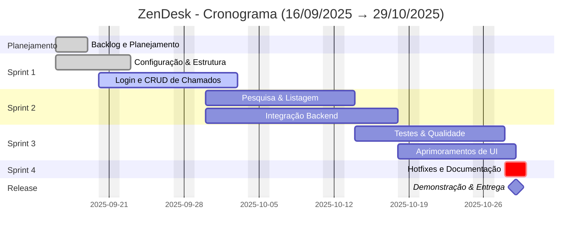

# Cronograma / Gantt

O projeto usa sprints e entregas entre **16/09/2025** e **29/10/2025**. Abaixo está um diagrama Gantt em Mermaid e um arquivo fonte `docs/gantt/gantt.mmd` para exportação.

## Visualização (Mermaid)



## Arquivo fonte para exportação

Um arquivo fonte Mermaid foi criado em `docs/gantt/gantt.mmd`. Use-o para exportar imagens (PNG/SVG) ou PDF com a ferramenta `@mermaid-js/mermaid-cli` (mmdc) ou com o editor online do Mermaid.

## Como exportar (PowerShell)

1) Instalar CLI (opcional, pode usar `npx` sem instalação global):

```powershell
# instalar globalmente (opcional)
npm install -g @mermaid-js/mermaid-cli

# ou usar npx diretamente (recomendado para um único uso)
```

2) Exportar para PNG (exemplo usando npx):

```powershell
npx @mermaid-js/mermaid-cli -i docs/gantt/gantt.mmd -o docs/gantt/assets/gantt.png
```

3) Exportar para SVG:

```powershell
npx @mermaid-js/mermaid-cli -i docs/gantt/gantt.mmd -o docs/gantt/assets/gantt.svg
```

Se preferir, abra `docs/gantt/gantt.mmd` no editor online do Mermaid (https://mermaid.live/) e exporte PNG/SVG diretamente.

---

Observação: se a pasta `docs/gantt/assets/` não existir, crie-a antes de exportar. O arquivo `docs/gantt/gantt.mmd` contém apenas o diagrama (sem markdown extra), facilitando a exportação.
